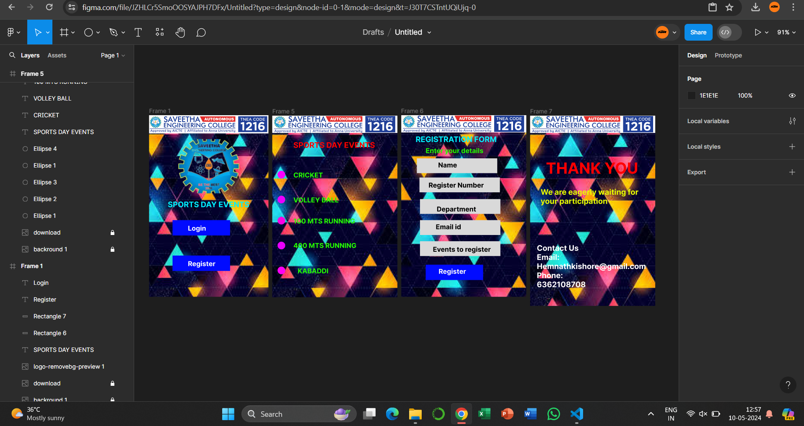

# Ex09 Event Registration Web Application
## Date: 10/05/2024

## AIM:
To design, develop and deploy a web application for event registration.

## DESIGN STEPS:

### Step 1:
Create a new frame.

### Step 2:
Select any one preset size of your choice.

### Step 3:
Select the shapes you need.

### Step 4:
Import images as needed.

### Step 5:
Create pages based on your need and link them.

### Step 6:

Validate the HTML and CSS code.

### Step 6:

Publish the website in the given URL.

## DESIGN TOOL:
Figma

## CODE:
```
<div style={{width: 249, height: 379, position: 'relative', background: 'white'}}>
  
  
  
  <div style={{width: 172, height: 28, left: 39, top: 177, position: 'absolute', color: '#00F0FF', fontSize: 16, fontFamily: 'Inter', fontWeight: '700', wordWrap: 'break-word'}}>SPORTS DAY EVENTS<br/></div>
  <div style={{width: 120, height: 32, left: 49, top: 293, position: 'absolute', background: '#010BFF'}} />
  <div style={{width: 120, height: 32, left: 49, top: 219, position: 'absolute', background: '#010BFF'}} />
  <div style={{width: 130, height: 16, left: 81, top: 301, position: 'absolute', color: 'white', fontSize: 14, fontFamily: 'Inter', fontWeight: '700', wordWrap: 'break-word'}}>Register</div>
  <div style={{width: 130, height: 16, left: 81, top: 227, position: 'absolute', color: 'white', fontSize: 14, fontFamily: 'Inter', fontWeight: '700', wordWrap: 'break-word'}}>Login</div>
</div>
```
```
<div style={{width: 261, height: 379, position: 'relative', background: 'white'}}>
  
  
  <div style={{width: 16, height: 16, left: 11, top: 115, position: 'absolute', background: '#FA00FF', borderRadius: 9999}} />
  <div style={{width: 16, height: 16, left: 11, top: 211, position: 'absolute', background: '#FF00E5', borderRadius: 9999}} />
  <div style={{width: 16, height: 16, left: 11, top: 167, position: 'absolute', background: '#EB00FF', borderRadius: 9999}} />
  <div style={{width: 16, height: 16, left: 11, top: 263, position: 'absolute', background: '#EB00FF', borderRadius: 9999}} />
  <div style={{width: 16, height: 16, left: 11, top: 315, position: 'absolute', background: '#FF00F5', borderRadius: 9999}} />
  <div style={{width: 172, height: 28, left: 44, top: 52, position: 'absolute', color: '#FF0000', fontSize: 16, fontFamily: 'Inter', fontWeight: '700', wordWrap: 'break-word'}}>SPORTS DAY EVENTS</div>
  <div style={{width: 130, height: 16, left: 44, top: 115, position: 'absolute', color: '#24FF00', fontSize: 14, fontFamily: 'Inter', fontWeight: '700', wordWrap: 'break-word'}}>CRICKET</div>
  <div style={{width: 130, height: 16, left: 44, top: 167, position: 'absolute', color: '#24FF00', fontSize: 14, fontFamily: 'Inter', fontWeight: '700', wordWrap: 'break-word'}}>VOLLEY BALL</div>
  <div style={{width: 130, height: 16, left: 44, top: 211, position: 'absolute', color: '#24FF00', fontSize: 14, fontFamily: 'Inter', fontWeight: '700', wordWrap: 'break-word'}}>100 MTS RUNNING</div>
  <div style={{width: 139, height: 17, left: 44, top: 262, position: 'absolute', color: '#24FF00', fontSize: 14, fontFamily: 'Inter', fontWeight: '700', wordWrap: 'break-word'}}>400 MTS RUNNING</div>
  <div style={{width: 130, height: 16, left: 53, top: 315, position: 'absolute', color: '#24FF00', fontSize: 14, fontFamily: 'Inter', fontWeight: '700', wordWrap: 'break-word'}}>KABADDI</div>
</div>
```
```
<div style={{width: 261, height: 379, background: 'white', justifyContent: 'flex-start', alignItems: 'flex-start', gap: 10, display: 'inline-flex'}}>
  
  
</div>
```
```
<div style={{width: 261, height: 397, position: 'relative', background: 'white'}}>
  
  
  <div style={{width: 194, height: 42, left: 33, top: 90, position: 'absolute', color: '#FF0000', fontSize: 32, fontFamily: 'Inter', fontWeight: '700', wordWrap: 'break-word'}}>THANK YOU</div>
  <div style={{width: 205, height: 70, left: 22, top: 150, position: 'absolute', color: '#EBFF00', fontSize: 16, fontFamily: 'Inter', fontWeight: '700', wordWrap: 'break-word'}}>We are eagerly waiting for your participation</div>
  <div style={{width: 232, height: 113, left: 14, top: 267, position: 'absolute', color: 'white', fontSize: 16, fontFamily: 'Inter', fontWeight: '700', wordWrap: 'break-word'}}>Contact Us<br/>Email: Hemnathkishore@gmail.com<br/>Phone:<br/>6362108708<br/></div>
</div>
```

## OUTPUT:


## RESULT:
The program to design, develop and deploy a web application for event registration is completed successfully.
